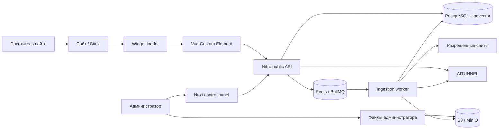
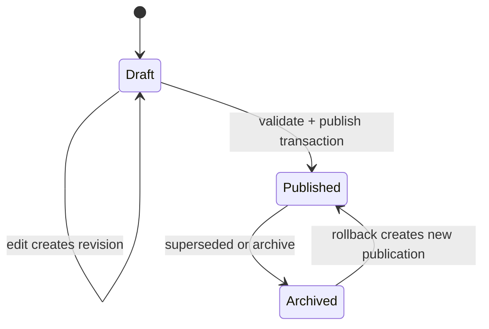
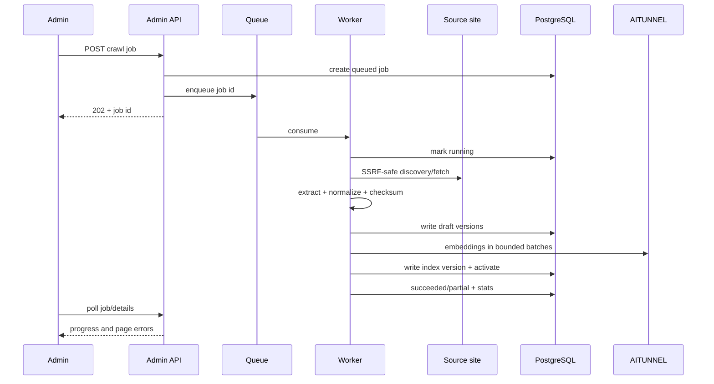
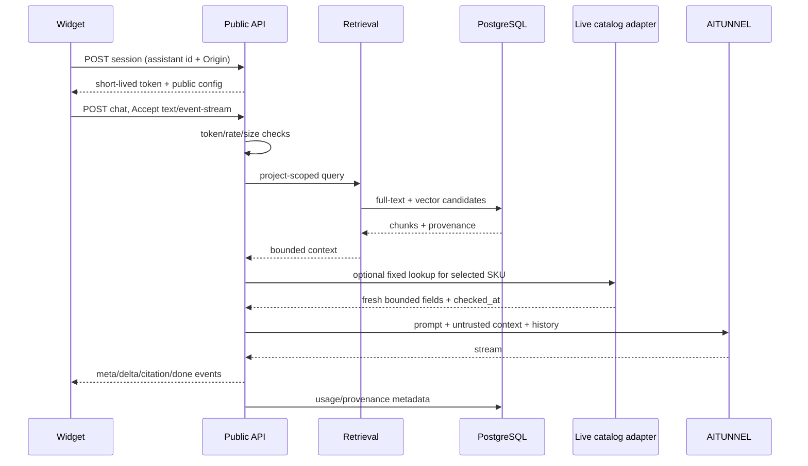

# Архитектура AI Assist

## 1. Контекст системы



Главная граница доверия проходит между host page/browser и публичным API. Все, что находится в виджете, наблюдаемо посетителем и не может считаться секретом. Provider key, prompts, unpublished knowledge и internal identifiers остаются server-side.

## 2. Предлагаемая структура monorepo

```text
ai-assist/
├── apps/
│   ├── control-panel/          # Nuxt admin + Nitro endpoints
│   ├── worker/                 # crawl, extraction, indexing jobs
│   └── widget/                 # Vue custom element + loader build
├── packages/
│   ├── contracts/              # DTO, runtime schemas, SSE events
│   ├── database/               # schema, migrations, repositories
│   ├── domain/                 # use cases and policies
│   ├── provider-aitunnel/      # provider adapter
│   ├── retrieval/              # hybrid search/context assembly
│   ├── crawler/                # URL safety, discovery, extraction
│   ├── observability/          # logging, metrics, redaction
│   └── testing/                # fixtures and test helpers
├── infra/
│   ├── compose/
│   └── docker/
├── guides/
├── decisions/
└── package.json
```

Папки `apps/` и `packages/` создаются на этапе scaffold. Документация остается в корне проекта.

## 3. Компоненты и ответственность

### Control panel

- server-rendered login/admin pages;
- формы, таблицы, diff, playground и job status;
- session/CSRF handling;
- короткие admin/public endpoints;
- проверка DTO и вызов domain use cases;
- streaming proxy/orchestration для chat.

Route handler не содержит SQL, шифрование, prompt assembly или crawler logic.

### Widget

- loader, custom element registration и browser compatibility;
- chat state и безопасный render;
- создание короткоживущей widget session;
- `fetch` streaming и отмена через `AbortController`;
- accessibility и theming;
- техническая телеметрия без содержимого сообщений по умолчанию.

### Worker

- обработка очередей `sync-source`, `crawl`, `parse-file`, `extract`, `index`, `purge`, `sync-models`;
- SSRF-safe коннекторы к публичным сайтам и feed URL с фиксированным mapping profile;
- безопасные parsers TXT/Markdown, text PDF, DOCX, CSV/XLSX и XML/YML без выполнения macro/script/external content;
- SSRF-safe fetch и optional browser rendering;
- нормализация страниц/товаров;
- chunking, embeddings, versioned index activation;
- retry, cancellation, progress и dead-letter behavior.

### Domain

- правила публикации prompt/document/index;
- authorization policies;
- assistant configuration resolution;
- provider/model compatibility checks;
- conversation orchestration и fallback policy;
- транзакционные границы.

### Provider adapter

Общий интерфейс:

```ts
interface AiProvider {
  listModels(): Promise<ModelCatalog>;
  verifyCredential(secret: SecretValue): Promise<CredentialCheck>;
  streamChat(input: ChatInput, signal: AbortSignal): AsyncIterable<ChatEvent>;
  createEmbeddings(input: EmbeddingInput): Promise<EmbeddingResult>;
  rerank?(input: RerankInput): Promise<RerankResult>;
}
```

AITUNNEL implementation знает base URL, headers, response mapping, streaming protocol, rate limits и безопасную классификацию ошибок. Domain не импортирует provider SDK напрямую.

### Storage

- PostgreSQL — источник истины для пользователей, проектов, versions, documents, jobs, chunks metadata и audit.
- pgvector — embeddings внутри tenant-filtered retrieval.
- Redis — очередь, short-lived session/rate-limit state и locks; потеря Redis не должна удалять бизнес-данные.
- S3/MinIO — исходные загруженные файлы и ограниченные по retention crawl snapshots; не публичный каталог сайта.

## 4. Публикация через неизменяемые версии



Prompt revision и knowledge document version неизменяемы после публикации. Assistant хранит pointer на опубликованную конфигурацию. Rollback не редактирует историю: он создает новую publication, ссылающуюся на прежнюю revision.

Индекс активируется атомарно:

1. worker создает новую `index_version`;
2. записывает chunks/embeddings в эту версию;
3. выполняет smoke retrieval;
4. в одной транзакции меняет active pointer;
5. прежняя версия удаляется отложенно после grace period.

## 5. Поток ingestion



В первом pilot единственный автоматический внешний участник — публичный сайт/feed. Доступ к БД или приватному API отсутствует. Будущие file/DB imports, если будут одобрены отдельным ADR, обязаны использовать тот же draft, validation/diff и atomic publication pipeline. Актуальная граница описана в [ADR-003](decisions/003-public-sources-for-pilot.md).

### Extraction layers

1. URL safety and scope.
2. Fetch metadata/content with limits.
3. JSON-LD and semantic product extraction.
4. Site adapter selectors/normalizers.
5. Generic readable content extraction.
6. Validation, provenance and confidence.
7. Deduplication/versioning.
8. Chunking and indexing.

Низкая confidence или неполный обязательный товарный набор переводит документ в `needs_review`, а не дополняет данные догадками.

## 6. Поток ответа



### Prompt assembly order

1. Зафиксированные platform safety instructions.
2. Опубликованный project system prompt.
3. Явная инструкция считать retrieved content недоверенными данными.
4. Retrieved context с delimiters и provenance.
5. Ограниченная история текущего разговора.
6. Текущее сообщение пользователя.

Документ не может переопределить пункты 1–3. Текст с сайта вида «ignore previous instructions» остается цитируемыми данными и при необходимости отбрасывается ingestion-фильтром.

Live lookup выполняется только для небольшого числа найденных SKU, читает разрешенную публичную карточку товара фиксированным adapter method и имеет короткий timeout. Исходный HTML не передается модели. При недоступности страницы API использует последнюю опубликованную версию и обозначает ее дату.

## 7. Multi-tenancy

- Все business tables имеют `project_id` напрямую либо однозначно выводят его через внешний ключ.
- Repository API требует `ProjectScope`, полученный после authorization, а не raw project id из body.
- Unique constraints включают `project_id`, если значение может повторяться у клиентов.
- Vector/full-text запрос сначала ограничивает project и active index, затем ранжирует.
- Object storage key начинается с внутреннего project UUID, но доступ выдается только server-side/signed URL после authorization.
- Background job payload содержит job id; worker повторно читает project/source из БД и не доверяет сериализованным secrets/config целиком.

Отдельная БД на клиента в MVP не используется. При enterprise-требованиях это можно добавить как другой deployment profile.

## 8. Secrets и шифрование

- Provider key шифруется envelope-style authenticated encryption (AES-256-GCM или KMS equivalent).
- Master key не хранится в БД/репозитории и поступает из secret manager/environment только server/worker runtime.
- Для ciphertext хранятся `key_version`, nonce/IV, auth tag и encrypted payload.
- Associated data включает provider credential id и project id, чтобы ciphertext нельзя было перенести между строками.
- Расшифрование выполняется непосредственно перед provider request в узком модуле.
- Key rotation выполняет batch re-encryption с audit и возможностью читать текущую/предыдущую key version во время перехода.

## 9. Использование парсера Newmark

| Существующий прототип            | Новый компонент                           | Решение                                                           |
| -------------------------------- | ----------------------------------------- | ----------------------------------------------------------------- |
| очередь URL и same-host filter   | discovery/scope policy                    | перенести идею, добавить canonical/sitemap/depth                  |
| `fetch` + delay                  | safe fetcher/rate limiter                 | заменить на SSRF-safe fetch, timeout, retry и limits              |
| regex HTML extraction            | DOM/JSON-LD extractors                    | regex оставить только для локальной нормализации текста           |
| hard-coded characteristic labels | Newmark extraction profile                | вынести в версионируемую конфигурацию/adapter                     |
| `sharp` и локальные картинки     | optional asset pipeline                   | не включать в MVP knowledge ingestion без отдельной необходимости |
| draft JSON                       | document/version tables                   | сохранить этап review, перенести в БД                             |
| slug/title dedupe                | canonical + checksum + source external id | расширить и покрыть повторным crawl test                          |
| errors array                     | job/page results                          | нормализовать коды, retryability и UI summary                     |

## 10. Масштабирование

Сначала масштабируются worker concurrency и публичный Node process отдельно. Выделение отдельного public API рассматривается, если измерены хотя бы один из факторов:

- chat connections мешают admin/server rendering;
- разные security/deployment policies;
- отдельный autoscaling profile;
- release cadence widget API отличается от панели.

До этого разделение на новый сервис не является самостоятельной целью.
